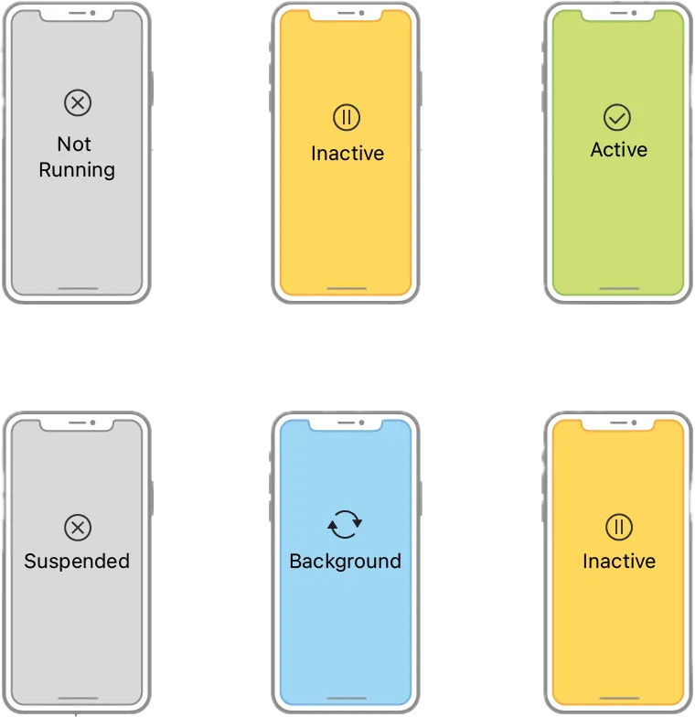
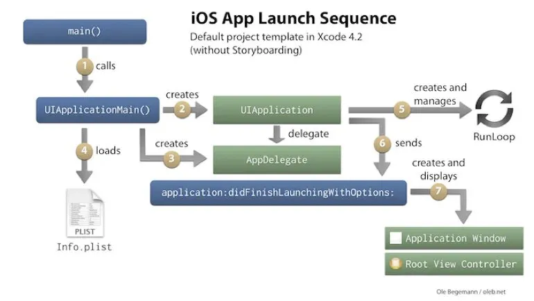
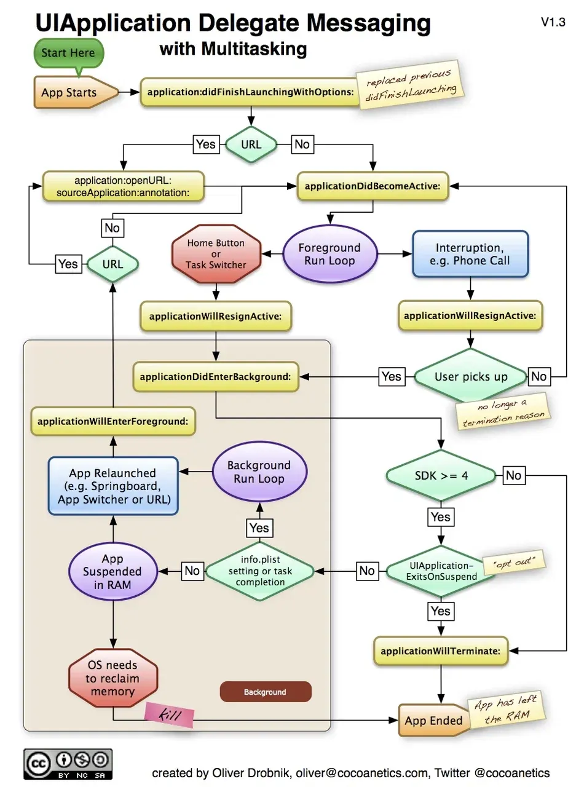

## UIApplicationDelegate

Жизненный цикл приложения описывает различные состояния, через которые проходит приложение, и события, которые вызывают переходы между этими состояниями.

---
### Состояния жизненного цикла приложения

  

    <ol>
      <li><a href="docs/AppLifecircle/notRunning.md">Not Running</a></li>
      <li><a href="docs/AppLifecircle/Inactive.md">Inactive</a></li>
      <li><a href="docs/AppLifecircle/Active.md">Active</a></li>
      <li><a href="docs/AppLifecircle/Background.md">Background</a></li>
      <li><a href="docs/AppLifecircle/Suspended.md">Suspended</a></li>
    </ol>
  

  

---
### Состояния жизненного цикла приложения
1. **Запуск приложения**: `Not Running` → `Inactive` → `Active`
2. **Переход в фон**: `Active` → `Inactive` → `Background` → `Suspended`
3. **Возвращение на передний план**: `Suspended`/`Background` → `Inactive` → `Active`
4. **Завершение приложения**: `Background` → `Not Running`

---

### Жизненный цикл AppDelegate & SceneDelegate
1. [Описание жизненного цикла AppDelegate](docs/AppDelegateLifiCircle/AppDelegateLC.md
)
2. [Жизненный цикл SceneDelegate](docs/SceneDelegate/SceneDelegate.md
)

---
### Диаграмма запуска приложения и его работа

---

### Диаграмма запуска приложения в контексте UIAppDelegate
