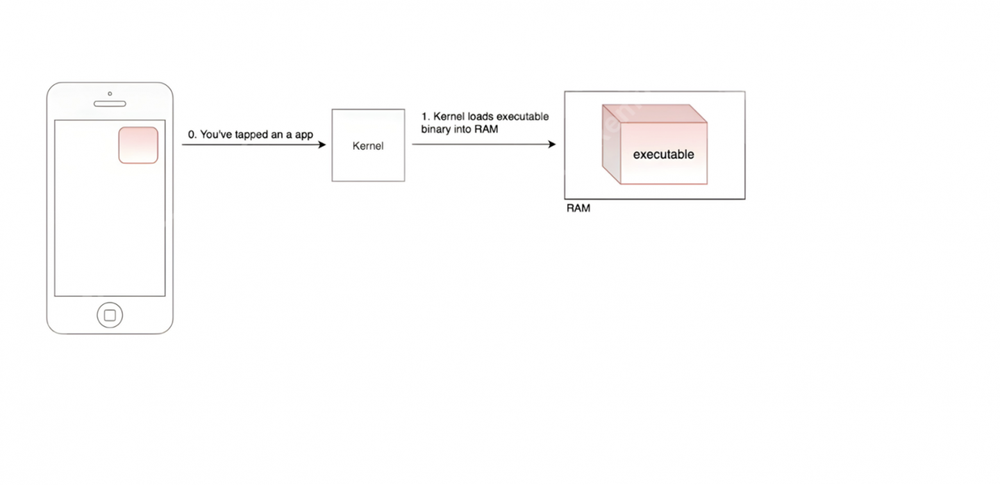
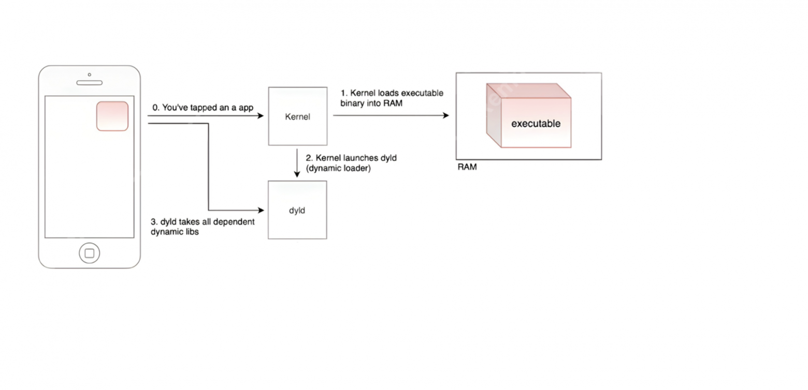
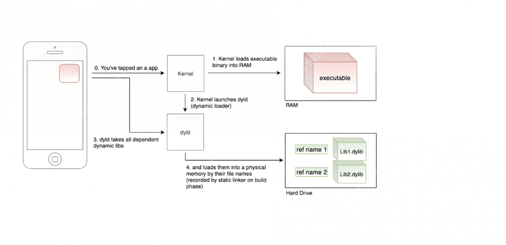
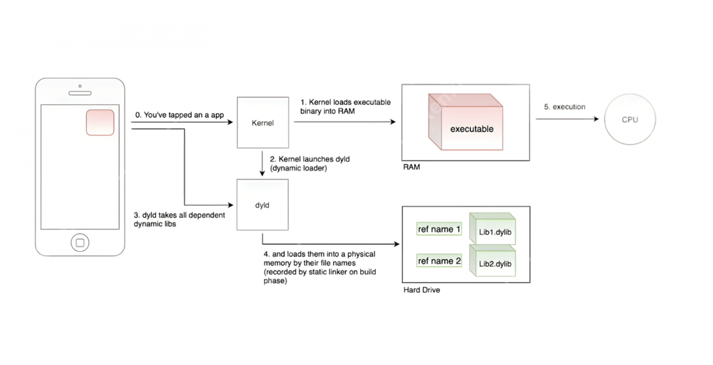
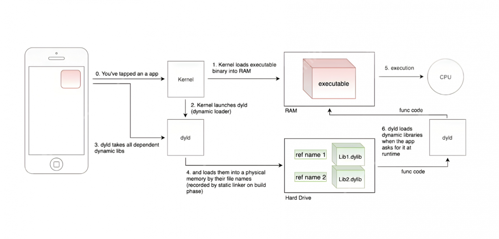

# Запуск приложения

Что происходит в тот момент, когда мы нажимаем на иконку приложения в телефоне? Ядро операционной системы берет Executable binary приложения и помещает его в оперативную память.

Дальше это же ядро запускает процесс под названием dyld или dynamical loader. 

Этот dyld забираем из приложения все фреймворки («динамические библиотеки») и на жестком диске строит что-то вроде словаря, где:

- ключ — это линковочное имя библиотеки, данное ей статическим линкером ещё в момент компиляции;
- а значение словаря — это сама библиотека.

После этого процессор начинает выполнять команды, описанные в Executable binary.

Вуаля — приложение открылось! 

#### Что происходит когда мы вызываем функцию из динамической библиотеки?

Представим нам надо посмотреть сторис, у нас есть функция, как openstory, которая живет в одной из динамических библиотек. Когда мы «тапаем», динамический лоадер понимает, что этой функции ещё нет памяти. Тогда лоадер обращается к той библиотеке, где она есть, и загружает функцию, которая отвечает за открытие конкретного этой сторис.

Далее лоадер помещает сторис в оперативную память, процессор начинает её выполнять и у нас перед глазами открытая история.