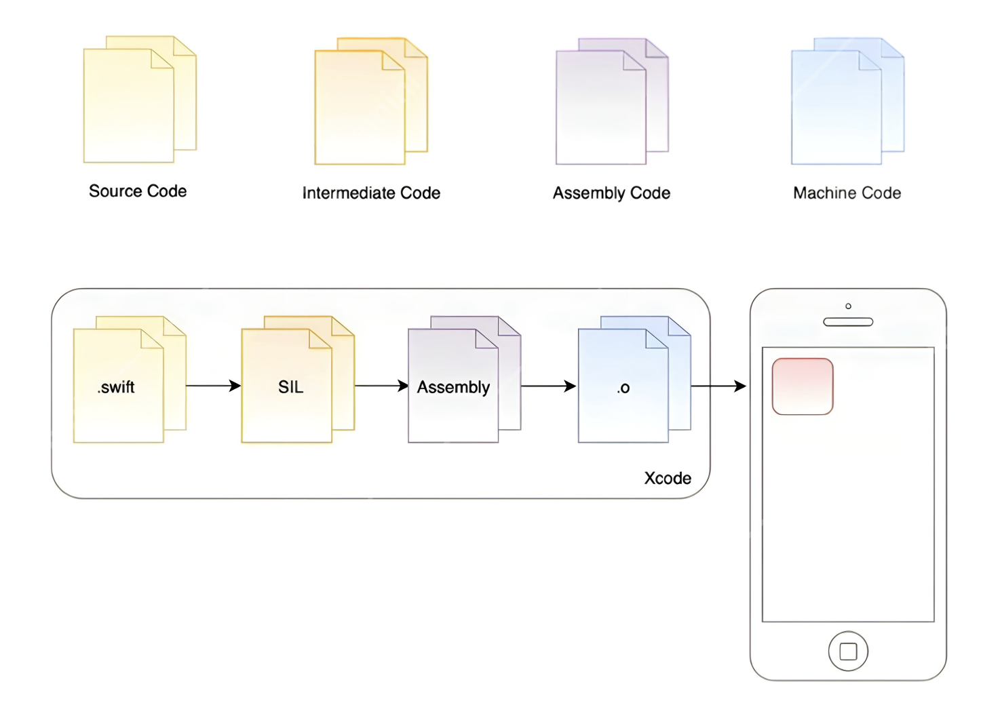
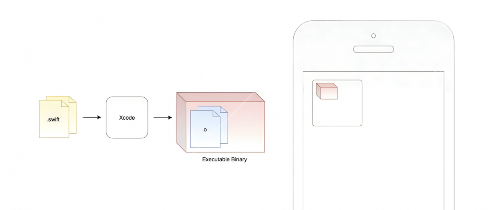

# Cущности

- «Исходный код» — код, на котором мы с вами пишем: Swift, Objective-C, C++.
- Промежуточный (Intermediate): живёт внутри компилятора, который, в свою очередь, применяет разные оптимизации.
- Assembly код — результат работы компилятора. Всё, что компилятор смог сделать с вашей программой, он представил в виде этого кода.
- Машинный: самое низкоуровневое представление вашей программы, которая представлена в виде последовательности нулей и единиц, группа которых образует инструкции для конкретного процессора.

Если грубо визуализировать процесс компиляции, то он будет выглядеть примерно так:

### Executable binary
Мы написали калькулятор: создали несколько Swift-файлов, несколько классов и калькулятор готов. 

Мы отдаем эти файлы в Xcode и нажимаем Cmd + B (Command Build). В результате получаем Executable binary. 

> Executable binary — это один файл, где вся ваша программа, весь ваш код представлен в виде машинного кода целиком. 

Executable binary живёт в нашем приложении на устройстве. И когда мы запускаем приложение, iPhone выполняет инструкции, которые в нём заложены.

> Это очень грубый процесс компиляции, лучше не говорить о таком на собесе

[Запуск приложения: что происходит под капотом](05_AppLaunch.md)