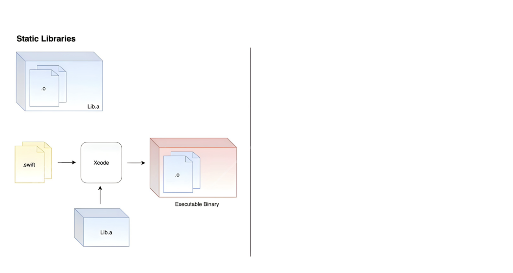
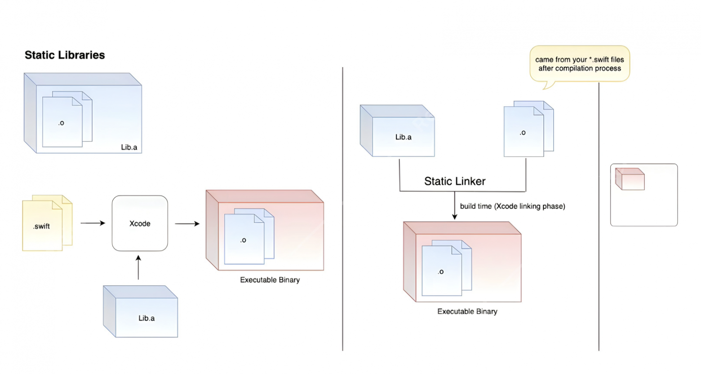
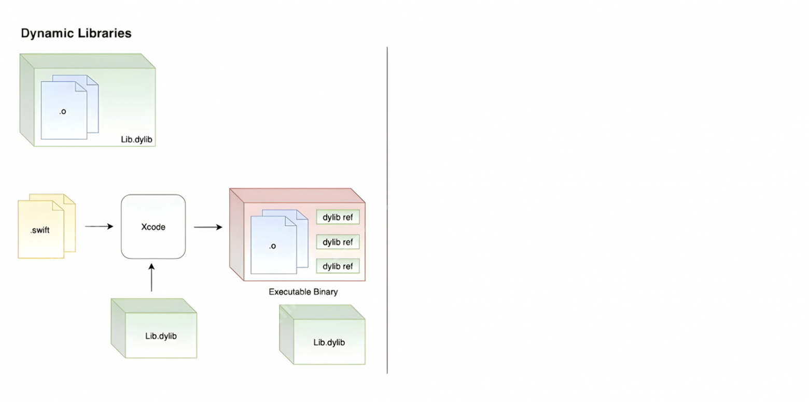
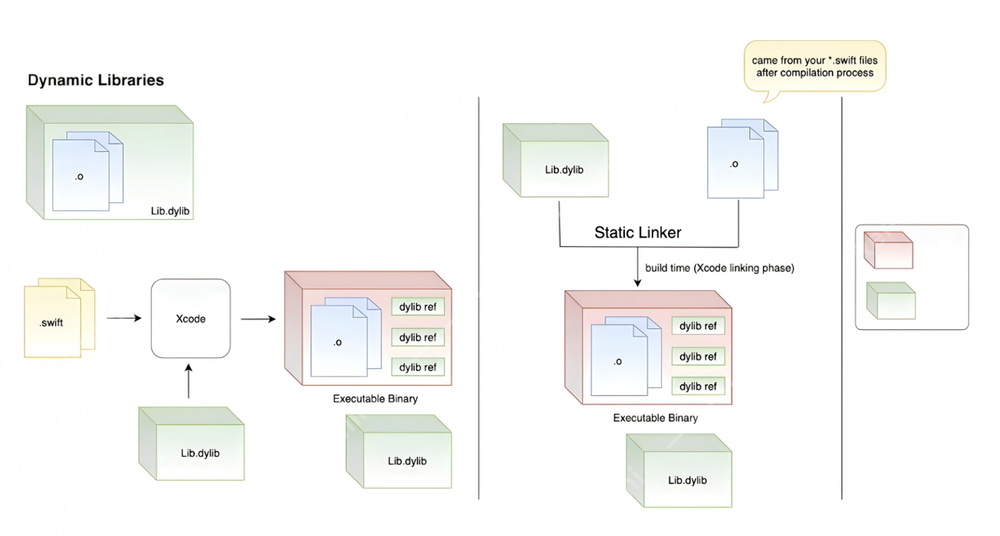

# Библиотеки

Допустим мы пишем калькулятор и решили добавить в него такую крутую функцию, как решение интегральных исчислений. Находим тех, кто написал алгоритм за нас и представил результаты своего труда в виде библиотеки.

Если мы взяли наш Swift-код, отдали Xcode, нажали кнопку Cmd + B и получили [Executable binary](02_BuildProcess.md#executable-binary), то разработчики библиотеки в аналогичном процессе получили библиотеку.

#### В чём отличия?

> Executable binary — это файл, с которым взаимодействует пользователь.
> Библиотека — это файл с кодом, с которым взаимодействует программист

---
### Есть 2 вида библиотек: статические и динамические

**Статическая библиотека — это binary** - такой же binary, как и Executable binary, где представлен весь код программы в виде машинного кода. 

### Что тут происходит?

- Xcode берёт машинный код нашей программы, полученный в результате компиляции
- берёт машинный код статической библиотеки
- механизм под названием статический линкер объединяет эти два вида кода в один и помещает в файл — в новый Executable binary

Этот файл живет в iPhone и когда запускаем приложение, процессором выполняются инструкции, заложенные в файле. 

---
**Динамическая библиотека** - такой же binary, как и Executable binary, и статическая библиотека. И под словами «такой же» подразумевается, что, как и в первых двух случаях, этот binary хранит в себе весь машинный код интегральных исчислений. 

### Как это работает?
- Swift-файлы с нашим калькулятором отдаём Xcode.
- Динамическую библиотеку также отдаём Xcode. 
- В Swift-файлах пишем ключевое слов import_название_библиотеки.
- Используем функции библиотеки.
- Калькулятор готов.
- Нажимаем Cmd + B.

Получаем Executable binary.

Этот Executable binary хранит в себе весь машинный код нашей программы, как и в предыдущих случаях, но в отличие от случая со статической библиотекой, этот Executable binary хранит в себе не код динамической библиотеки, а только ссылки на этот код. 

Сам код библиотеки хранится обособленно в отдельном файле. Рассмотрим этот нюанс подробнее

- Xcode берёт машинный код нашей программы
- берёт динамическую библиотеку
- всё тот же статический линкер всё это объединяет, добавляя ссылки на функции динамической библиотеки

На выходе мы получаем, как минимум, два файла: один файл — наш Executable binary, с нашей программой, а другой — файл библиотеки с функциями интегрального исчисления.

И теперь на нашем устройстве в нашем приложении лежат как минимум 2 файла: один — с нашей программой, другой — с кодом библиотеки.

> Когда мы запускаем приложение, то динамическая библиотека загружается в память, не сразу как Executable binary, а только по требованию. И загружается она не целиком — загружаются только те функции, которые используются приложением в данный момент.

# Сравнение статических и динамических библиотек

| Критерий                | Статическая библиотека                           | Динамическая библиотека                          |
|-------------------------|------------------------------------------------|-------------------------------------------------|
| Скорость вызова функции | Быстрее — функции загружены в память сразу после старта приложения. | Медленнее — требуется загрузка библиотеки в память перед вызовом. |
| Размер в памяти         | Загружается целиком вместе с приложением — больший размер.         | Загружается по требованию — экономия памяти.     |
| Скорость запуска        | Быстрая загрузка, если библиотека небольшая; может замедлить старт, если библиотека большая (например, 400 Мб загружается целиком). | Быстрее для больших библиотек, так как загружается только используемая часть; но много мелких библиотек могут замедлить запуск из-за проверки и валидации всех файлов. |
| Линковка                | Копирование машинного кода в каждый модуль, что увеличивает размер проекта. | Один экземпляр в памяти для всех модулей, экономит место. |

**Вывод:**  
- Статические библиотеки подходят, если важна скорость вызова функций и проект небольшой/средний по размеру.  
- Динамические библиотеки выгодны для экономии памяти и разделения работы на модули, особенно в больших проектах.  
- Выбор зависит от конкретных требований приложения и компромиссов между размером, производительностью и удобством разработки.

