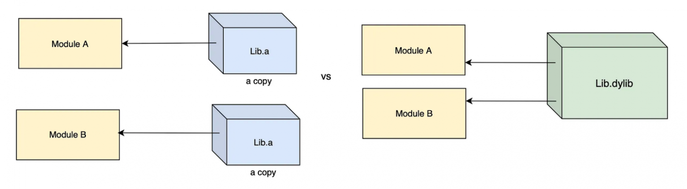
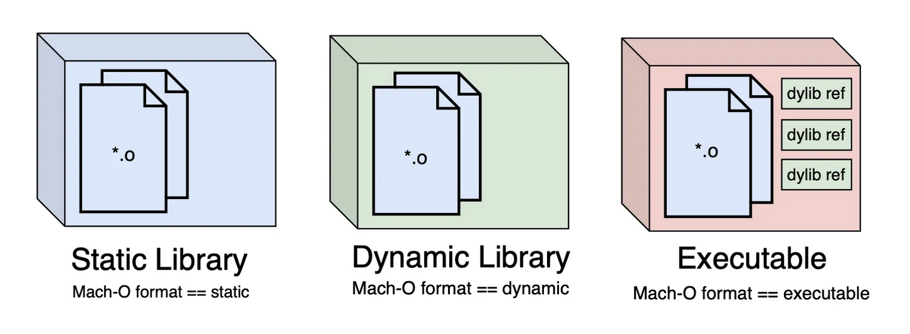

# Линковка или использование библиотек.

Если у нас есть несколько модулей в проекте, и все они используют одну и ту же статическую библиотеку, то каждый модуль получит в себя копию машинного кода библиотеки. И нетрудно догадаться, что весь проект начнёт расти кратно размеру библиотеки.

В то же время экземпляр динамической библиотеки в памяти всего один. Сколько бы модулей на неё не ссылалось, они получат лишь ссылки на её функции, и размер самого приложения не будет расти. 

---
### Mach-O — это формат файла

Все эти бинарники хранят в себе машинный код. Но как он там хранится — определяется форматом.

- Статический формат файла позволяет брать машинный код и копировать его в другое место.
- Динамический формат позволяет делать ссылки на машинный код.
- А executable-формат позволяет запускать этот код.

> Executable binary — это результат компиляции кода