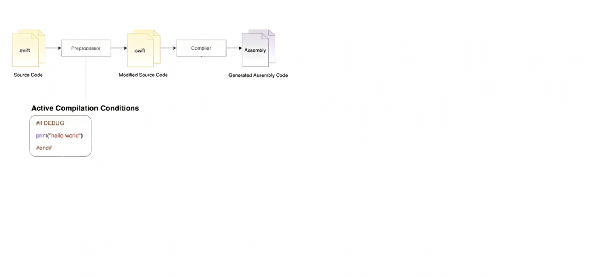

# Процесс компиляции 

### Xcode

У нас есть Swift-файлы с нашей программой. Мы отдаём их Xcode и первое, что их встретит — это препроцессор. На вход препроцессора мы отдаем Swift-файлы. На выходе получаем Swift-файлы.


Что происходит внутри препроцессора? 

### Препроцессор

```swift
#if DEBUG
    print(“hello world”)
#endif
```

В англоязычном коммьюнити это называется Active Compilation Conditions. Это вещи, благодаря которым препроцессор понимает, какой Swift-код вам оставить. 

- Если условие удовлетворяет текущему положению вещей, когда вы билдите, препроцессор оставляет этот Swift-код.
- Если не удовлетворяет — вырезает, будто ничего и не было.


На этом задача препроцессора заканчивается. 

Дальше ваш Swift-код встретит компилятор.

### Компилятор

Результат работы компилятора — Assembly-код. 



#### Что происходит внутри компилятора?

- На вход компилятора приходит Swift-код.
- Внутри код компилируется в intermediate-код.
- На выходе компилятор отдаёт нам Assembly-код.

Когда мы говорим об оптимизациях на этапе компиляции, то подразумеваем оптимизации, которые происходят в момент компиляции intermediate языка. И происходят они вот здесь:


#### Появление Executable binary

Теперь у нас есть крутооптимизированный Assembly-код, который попадает в механизм под названием Assembler. 

И вот уже Assembler даёт нам тот самый машинный код, о котором мы говорили в начале. Теперь этот машинный код попадает в [статический линкер](04_Linking.md)


Помимо нашего машинного кода туда попадают и статические, и динамические библиотеки.


И в этот момент как раз и происходит создание того самого Executable binary.


