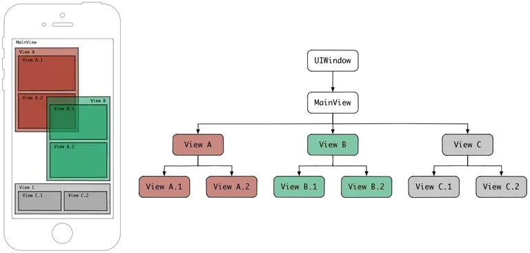

# HitTest механизм: определение получателя касаний

`hitTest(_:with:)` - это метод UIView, который определяет самое верхнее (по z-index) view, способное обработать касание в заданной точке. Это первая фаза обработки касаний в iOS, происходящая ДО начала передачи событий по `Responder Chain`.

```swift
func hitTest(_ point: CGPoint, with event: UIEvent?) -> UIView?
```

Возвращает:
- UIView - самое верхнее view в точке касания
- nil - если точка вне границ или view не может принять касание

---
### Алгоритм работы
Hit-testing использует `reverse pre-order depth-first traversal` - обход дерева view в обратном порядке:

```swift
override func hitTest(_ point: CGPoint, with event: UIEvent?) -> UIView? {
    // 1. Проверка базовых условий
    guard isUserInteractionEnabled, 
          !isHidden, 
          alpha > 0.01 else { return nil }
    
    // 2. Точка внутри bounds?
    guard point(inside: point, with: event) else { return nil }
    
    // 3. Проверяем subviews в ОБРАТНОМ порядке (последний добавленный первый)
    for subview in subviews.reversed() {
        let convertedPoint = subview.convert(point, from: self)
        if let hitView = subview.hitTest(convertedPoint, with: event) {
            return hitView // Нашли! Прекращаем поиск
        }
    }
    
    // 4. Subviews не подошли — возвращаем себя
    return self
}
```

---
#### Диаграмма, иллюстрирующая процесс единственного касания — от момента, когда палец касается экрана, и до момента, когда он убирается с экрана.


Как показано на диаграмме, hit-testing выполняется каждый раз, когда палец касается экрана, и до того, какой-либо view или gesture recognizer получит объект UIEvent, представляющий событие, к которому относится данное касание.

После завершения hit-testing и определения view, находящегося в самой верхней точке под касанием, назовём его hit-test view, этот view привязывается к объекту UITouch на всю последовательность фаз данного события касания, то есть began, moved, ended или canceled. Помимо этого hit-test view, к объекту UITouch привязываются все gesture recognizers, прикреплённые к этому view и к его view-предкам. Затем hit-test view начинает получать всю последовательность событий касания.

> «Объект касания связывается со своим hit-test view на весь период жизни, даже если касание позже выходит за пределы этого view».

---
Как уже упоминалось, hit-testing использует алгоритм обхода в глубину в обратном порядке. Другими словами, алгоритм сначала посещает root node, затем обходит его поддеревья от верхних индексов к нижним. Такой порядок обхода позволяет минимизировать число итераций, останавливая поиск, когда первый, самый глубоко лежащий дочерний view, содержащий точку касания, найден. Это возможно, потому что в iOS-представлении:

- Subview всегда рисуется поверх своего superview.
- Соседние subview всегда рисуются в порядке их индекса в массиве subviews. Тот, что добавлен позже или перемещён в конец массива, будет перекрывать предыдущий.

Если несколько перекрывающихся view содержат одну и ту же точку, наиболее глубоко лежащий view в правом “ветвевом” поддереве будет находиться сверху.

> «Визуально, содержимое subview частично или полностью закрывает содержимое parent view. Каждое superview хранит свои subviews в упорядоченном массиве, и порядок в этом массиве также влияет на видимость subviews. Если два соседних subviews перекрывают друг друга, то то, что было добавлено последним, или перемещено в конец массива subviews, появляется поверх другого».
[View Programming Guide for iOS, iOS Developer Library](https://developer.apple.com/library/archive/documentation/WindowsViews/Conceptual/ViewPG_iPhoneOS/WindowsandViews/WindowsandViews.html#//apple_ref/doc/uid/TP40009503-CH2-SW24)

---
Ниже показана диаграмма, представляющая пример view hierarchy tree и соответствующего ему интерфейса на экране. Порядок ветвей, слева направо, отражает порядок массива subviews.



Можно заметить, что «View A» и «View B», а также их children view «View A.2» и «View B.1» накладываются друг на друга. Но поскольку «View B» имеет индекс subview выше, чем «View A», то «View B» и все его subviews визуально располагаются над «View A» и его subviews. Поэтому, если пользователь нажмёт на область «View B.1», которая перекрывает «View A.2», hit-testing вернёт «View B.1».

Применение обхода в глубину в обратном порядке позволяет прекратить обход сразу, как только найден первый, наиболее глубоко лежащий view, содержащий точку касания:


Алгоритм обхода начинается с отправки сообщения hitTest:withEvent: объекту UIWindow, который является корневым вью иерархии. Возвращаемое значение этого метода — это находящееся сверху вью, содержащее точку касания.

#### Блок-схема, иллюстрирующая логику hit-test


---
### Как может выглядеть реализация нативного метода `hitTest:withEvent:`

```swift
- (UIView *)hitTest:(CGPoint)point withEvent:(UIEvent *)event {
    if (!self.isUserInteractionEnabled || self.isHidden || self.alpha <= 0.01) {
        return nil;
    }
    if ([self pointInside:point withEvent:event]) {
        for (UIView *subview in [self.subviews reverseObjectEnumerator]) {
            CGPoint convertedPoint = [subview convertPoint:point fromView:self];
            UIView *hitTestView = [subview hitTest:convertedPoint withEvent:event];
            if (hitTestView) {
                return hitTestView;
            }
        }
        return self;
    }
    return nil;
}
```

Метод hitTest:withEvent: сначала проверяет, может ли вью принять касание. Вью может получить касание, если:
- View не скрыто — self.hidden == NO.
- У view включён userInteractionEnabled — self.userInteractionEnabled == YES.
- Уровень прозрачности view больше 0.01 — self.alpha > 0.01.
- Точка действительно находится внутри view — [self pointInside:point withEvent:event] == YES.

Далее, если view может получить касание, метод обходит его subviews, отправляя им hitTest:withEvent: в порядке с конца к началу массива. Если одно из subviews вернуло не nil, то оно — это subview, является верхним view в точке касания и возвращается. Если все subviews вернули nil или их просто нет, то метод возвращает само текущее view.

В противном случае, если view не подходит под условия, метод возвращает nil и не обходит subview. Благодаря этому hit-test может не посещать все view в иерархии.

---
### Случаи переопределения ```hitTest:withEvent:```

1. **Перенаправление всех фаз касания от одного view к другому**

    Метод hitTest:withEvent: может быть переопределён, если события касания, предназначенные для одного view, надо перенаправить другому view на все фазы данного касания. Поскольку hit-test выполняется до отправки первого события касания — UITouchPhaseBegan, и только один раз на все дальнейшие фазы, переопределение hitTest:withEvent: для перенаправления означает, что все касания этой последовательности будут перенаправлены.

2. **Увеличение области касания - touch area**

    Один из вариантов, когда логично переопределить метод hitTest:withEvent:, — это увеличение области касания view, если по умолчанию она слишком мала. Например, у нас есть UIView размером 20×20; это может быть неудобным для касания, особенно если пользователь промахивается мимо. Мы можем расширить область реагирования на 10 точек в каждую сторону, переопределив hitTest:withEvent: следующим образом:

    ```swift
    - (UIView *)hitTest:(CGPoint)point withEvent:(UIEvent *)event {
    if (!self.isUserInteractionEnabled || self.isHidden || self.alpha <= 0.01) {
        return nil;
    }
    CGRect touchRect = CGRectInset(self.bounds, -10, -10);
    if (CGRectContainsPoint(touchRect, point)) {
        for (UIView *subview in [self.subviews reverseObjectEnumerator]) {
            CGPoint convertedPoint = [subview convertPoint:point fromView:self];
            UIView *hitTestView = [subview hitTest:convertedPoint withEvent:event];
            if (hitTestView) {
                return hitTestView;
            }
        }
        return self;
    }
    return nil;
    }
    ```

    ```swift
    override func hitTest(_ point: CGPoint, with event: UIEvent?) -> UIView? {
    // 1. Проверяем базовые условия
    if !isUserInteractionEnabled || isHidden || alpha <= 0.01 {
        return nil
    }
    
    // 2. Увеличиваем bounds: расширяем на 10 по всем сторонам
    let touchRect = bounds.insetBy(dx: -10, dy: -10)
    
    // 3. Проверяем, попадает ли тап в расширенную область
    if touchRect.contains(point) {
        // 4. Ищем подходящий сабвью (в обратном порядке)
        for subview in subviews.reversed() {
            let convertedPoint = subview.convert(point, from: self)
            if let hitTestView = subview.hitTest(convertedPoint, with: event) {
                return hitTestView
            }
        }
        // Если сабвью не подошли, возвращаем self
        return self
    }
    return nil
    }
    ```

    > ⚠️ Важно: чтобы это работало корректно, bounds parent view тоже должны содержать желаемую область для касания. Иначе parent view также нужно переопределять, расширяя для него логику hitTest.

1. **Пропуск касаний «сквозь» вью к нижележащим вью**

    Иногда нужно, чтобы view игнорировало касания и «пропускало» их к расположенным ниже view. Например, представим прозрачный оверлей поверх всех view приложения. На нём могут быть некоторые кнопки и контролы, которые должны обрабатывать касания в обычном режиме, а все остальные касания, по «пустому» месту оверлея, нужно пропускать к view под оверлеем.

    Для этого в переопределённом методе hitTest:withEvent: оверлея можно возвращать одно из его subview, если точка находится внутри него, и nil во всех остальных случаях, включая случай, когда точка пересекает сам оверлей:

    ```swift
    - (UIView *)hitTest:(CGPoint)point withEvent:(UIEvent *)event {
        UIView *hitTestView = [super hitTest:point withEvent:event];
        if (hitTestView == self) {
            hitTestView = nil;
        }
        return hitTestView;
    }
    ```

    ```swift
    override func hitTest(_ point: CGPoint, with event: UIEvent?) -> UIView? {
        var hitTestView = super.hitTest(point, with: event)
        
        if hitTestView === self {
            hitTestView = nil
        }
        
        return hitTestView
    }
    ```

1. **Передача событий касания child view**

    Другой случай — когда parent view должно полностью передавать все события касания единственному child view. Такое бывает, если child view занимает только часть parent, но должен реагировать на все касания во всей области parent.

    Например, представь «карусель» изображений: parent view и внутри него UIScrollView с включённым pagingEnabled и отключённым clipsToBounds, чтобы был виден «эффект карусели»:

    

    >Схематическое изображение, где всё касание перенаправляется в UIScrollView

    Чтобы UIScrollView реагировал на касания не только в своих границах, но и в пределах parent view, в parent view можно переопределить hitTest:withEvent: так:

    ```swift
    - (UIView *)hitTest:(CGPoint)point withEvent:(UIEvent *)event {
    UIView *hitTestView = [super hitTest:point withEvent:event];
    if (hitTestView) {
        hitTestView = self.scrollView;
    }
    return hitTestView;
    }
    ```

    ```swift
    override func hitTest(_ point: CGPoint, with event: UIEvent?) -> UIView? {
    // Вызываем стандартную реализацию
    let hitTestView = super.hitTest(point, with: event)
    // Если что-то найдено (не nil), принудительно возвращаем scrollView
    if hitTestView != nil {
        return scrollView
    }
    return nil
    }
    ```